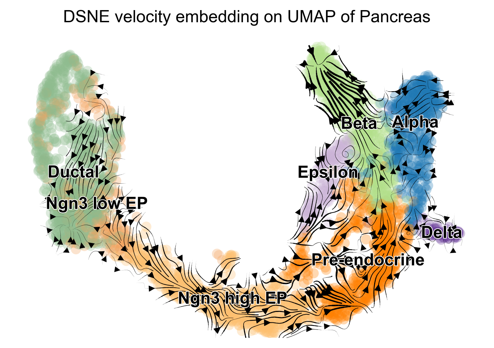

# DSNE
Python library containing DSNE algorithms. 
[Preprint](to be appear)

## Installation

## Requirements

- [cblas](http://www.netlib.org/blas/) or [openblas](https://github.com/xianyi/OpenBLAS).
Tested version is v0.2.5 and v0.2.6 (not necessary for OSX).

From Github:

```
git clone https://github.com/songtingstone/dsne
cd dsne/
make cleanpackage 
```

From PyPI:

```
pip install dsne
```

From conda:

```
conda install -c maxibor dsne
```

## Usage

Basic usage:

```python
from dsne import DSNE
W = DSNE(X,V,Y)
```

### Examples

- [Simulation with Exact Velocity Embeddings](https://github.com/songtingstone/dsne/examples/exact_simulation.py)
- [Simulation with Approximate Velocity Embeddings](https://github.com/songtingstone/dsne/examples/unexact_simulation.py)
- [Pancreas](https://github.com/songtingstone/dsne/examples/Pancreas.py) 
## Algorithms

### DSNE 
Direction Stochastic Nearnest Neighbor Embedding of Velocity 

